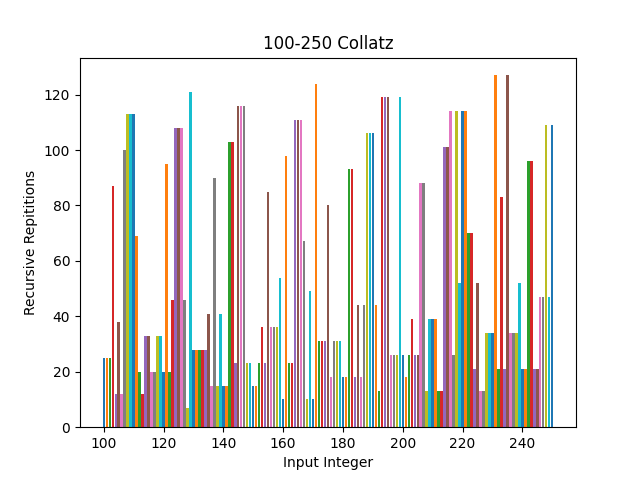

# Frequency Graphs & Collatz Conjecture

This repository contains implementations for computing and visualizing data related to the **Collatz Conjecture**, with a focus on measuring **frequency** and **count** statistics for various input ranges. The project includes **C++ programs** for generating data and **Python scripts** for plotting and analyzing results.

## What is the Collatz Conjecture?

The **Collatz Conjecture** is a mathematical problem proposed by Lothar Collatz in 1937. It states that for any positive integer `n`, the following sequence will eventually reach `1`:

1. If `n` is even → divide it by `2`:  
   `n = n / 2`
2. If `n` is odd → multiply by `3` and add `1`:  
   `n = 3n + 1`
3. Repeat the process until `n == 1`.

There is no current proof of the conjecture. However, there are many interesting numerical patterns that appear throughout the data that we can explore with MatPlotLib.

## Program Usage

See the indiviual README's inside the files for specific instructions on usage.

## Summary

The main goal of this project was to learn more about data visualization, as well as practice integrating python scripts and high performing C++ code into one project. The following are a few examples of the data I gathered about the conjecture. The **count** statistic refers to the number of recursive calls made to the Collatz function before the given input number reduced to 1. The **frequency** statistic refers to how often a given number appears in the conjecture when I run through a given range of numbers.

